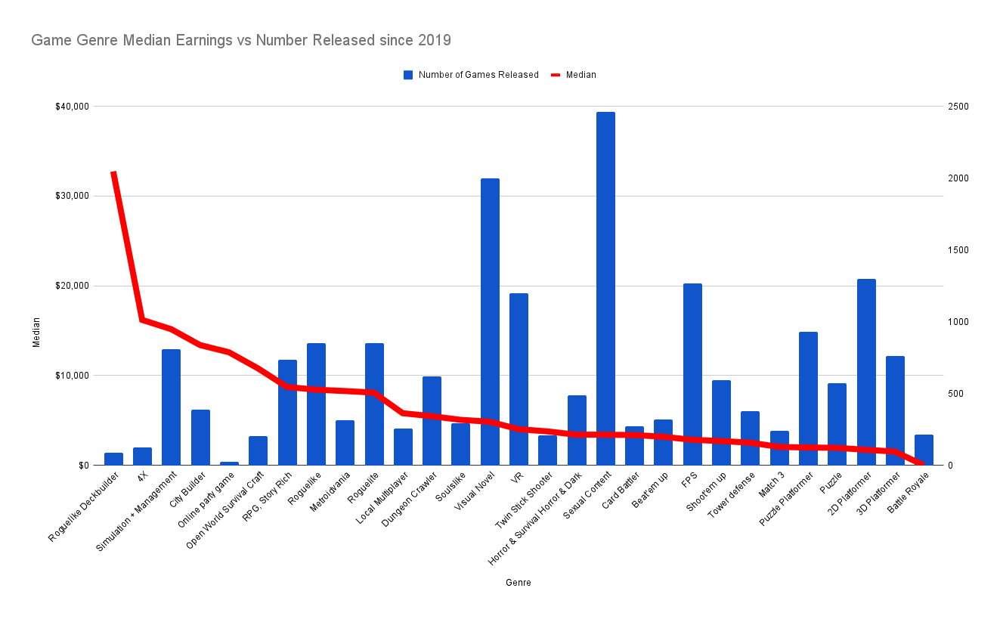

+++
title = "why the (virtual) violence?"
date = "2023-11-18"
description = "Questioning the need for malevolent forces in games."
tags = [
    "design"
]
+++

Have you ever wondered how many virtual foes you have vanquished in your lifetime?

Think about it. Whether you're playing _Pokemon_, _Halo_, _World of Warcraft_, or _Baldur's Gate_, in order to win, you need to slay the enemies in your path.

Over the years I've had this thought lingering in the back of my head:

## why do so many games rely on violence?

Let's ask an expert.

Masahiro Sakurai, the legendary game designer behind classic Nintendo titles like _Super Smash Bros._, has a [fantastic youtube channel](https://www.youtube.com/@sora_sakurai_en). They are usually bite-sized opinion pieces on various aspects of game development, covering art, programming, design, and more.

Check out his video on the topic of enemies:



Sakurai defines a 4-step feedback loop for the player experience:

1. **Stress** - create tension.
2. **Relief** - release tension.
3. **Growth** - increase in power.
4. **Progress** - new challenges.

He notes that without the conflict created by introducing stress, it's difficult to deliver the feelings of relief, growth, and progress to the player.

Although there are other ways to add stress than placing enemies in the player's path, _bad guys_ are by far the most frequently used. 

In my opinion, there are two primary reasons for this:

1. **clarity**: It's surprisingly hard to convey to the player what they are supposed to do when they are playing a game. Put a gun in their hand and send a sword-wielding maniac charging at them and they will figure it out. If they don't, death is an unambiguous _you lose_ state. Similarly, killing an enemy is a clear signal that the stressor has been eliminated and relief can set in.

2. **convenience**: From a technical standpoint, absolute _alive_ or _dead_ states are convenient ways to evaluate game progress. Additionally, there are countless existing games that have experimented with different ways to destroy foes, providing useful reference for games currently in development. The language of violence in games is clearly established and has precedent. Players will usually just _get it_: kill the enemies, get loot, level up, etc.

I don't want to dwell on the usage of violence too much longer. To be clear, I am a fan of many games that happen to feature gratuitous violence. Destroying enemies is fun. However, I can only watch so many reveal trailers featuring gun-toting player avatars mowing down hordes of generic creatures before I start to roll my eyes.

## what's the problem with violence in games?

For our purposes, a _violent game_ is a game in which you make progress in the game by inflicting damage or otherwise causing harm.

I have a couple of issues with the prevalence of violent games in the industry.

**the ratio of violent to nonviolent games is too high**

With our incredibly vague definition, most games are violent games. To reiterate, violent games are not inherently worse or morally corrupt or anything like that. It just feels like there is a vast unexplored design space, like the depths of the ocean, beyond the purview of today's game industry.

Violent game design restricts the options available to the player to those focused on physically destroying them. Story-based violent games often flirt with providing nonviolent options to the player, letting conversation be an alternate route to resolving conflict. Rarely is that sort of game mechanic a prominent feature of a game.

An easy retort to this claim would be that nonviolent games are boring or simplistic, which would explain why violent games are more popular. To me, that's a game design problem. Figuring out how to make nonviolent games fun unlocks entirely new genres of gameplay. Look at the success of games like _Minecraft_ and _Stardew Valley_, which focus primarily on creativity and expression. There are some studios looking to iterate on those successes, but they are dwarfed by the developers working on violent games.

**the audience for nonviolent games is underserved**

Not every player is interested in playing a violent game. This is becoming more of an issue as the average player gets older and is less excited by high intensity, graphic games. Anecdotally, my parents both are interested in playing games, but find the game industry doesn't produce any games that suit their player profile.

Take a look at this graph from [this blog reviewing which genres are popular on Steam](https://howtomarketagame.com/2022/04/18/what-genres-are-popular-on-steam-in-2022/):

The graph is sorted - from left to right the genres are listed from most profitable to least profitable. On the left side are a few genres that typically contain less violent games:

* **4X (explore, expand, exploit, exterminate)**: while there are often battles involved in games in this genre, there are usually other methods of progression and violence is not the primary focus of the game.
* **Simulation and Management**: this genre has seen multiple hits that have been popular with "non-gamers". I like to call them, "people who would play games, if only there was a game that fits their interests". _Farming Simulator_, a game where you can sit on a tractor for hours, sells [millions of copies](https://www.pcgamer.com/farming-simulator-19-sold-over-two-million-copies/).
* **City Builder**: I have such fond memories of playing _Sim City_ as a kid. Back in those days, it felt like there were so many more options in this genre, or at least so many variants of the _Roller Coaster Tycoon_ model. With the _Sim City_ franchine [burned to the ground by EA](https://www.gamesindustry.biz/always-online-simcity-burns-to-the-ground-10-years-ago-this-month), you would think that there would be plenty of opportunistic companies looking to capture that market and genre. Instead, the only big player is _Cities Skylines_, which isn't without its problems.

Why aren't game developers flocking to these genres, which are proven to be some of the highest selling and have relatively less competition than oversaturated genres like shooters or platformers?

You might argue that games in these genres are harder to make and would take more time. From personal experience working for AAA companies on shooters, battle royales, etc., I know for a fact that they are just as complex and time-consuming to build.

In lieu of a clear explanation here, I just want to note that there is plenty of opportunity for success in these markets.

## where do we go from here?

I'm hoping that the industry starts allocating more resources towards nonviolent games. There's promising movement in that direction lately:

* There's a up-and-coming movement around "wholesome games", which are focused on cute, cozy and compassionate player experiences. There's even a _Nintendo Direct_-style event called [_Wholesome Direct_](https://www.youtube.com/watch?v=hHPF2g1HyLs).
* Big releases from AAA companies trying to recreate the success of games like _Stardew Valley_. For example, Disney's [_Dreamlight Valley_](https://disneydreamlightvalley.com/) and Riot's [_Bandle Tale_](https://store.steampowered.com/app/1759380/Bandle_Tale_A_League_of_Legends_Story/).

I firmly believe that if there were more nonviolent games being made, violent games would benefit as well. Great gameplay ideas often cross-pollinate between genres. Successful nonviolent games would serve as an example of what is entertaining to do during downtime or low-stress moments of violent games.

More diversity in player experiences is a good thing. Hopefully, we'll look back on this era of the game industry and note how one-dimensional it was.

In my ideal world, there are games available for every kind of player.